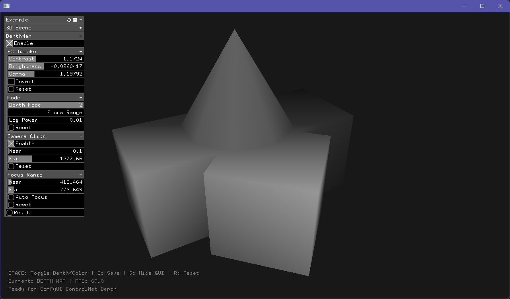

# ofxSurfingDepthMap

*Depth-map shader based add-on. Developed for seamless integration with AI workflows and real-time 3D applications.*



## Features

- **3 Depth Mapping Modes**: Linear, Logarithmic, and Focus Range
- **Manual Camera Control**: Bypass camera near/far planes with manual clipping
- **Real-time Preview**: Toggle between color and depth map rendering
- **ControlNet Ready**: Outputs grayscale depth maps suitable for AI processing
- **Flexible Controls**: Contrast, brightness, gamma, and inversion parameters
- **Auto Focus**: Intelligent depth range calculation for complex scenes

## Quick Start

```cpp
// ofApp.h

#include "ofxSurfingDepthMap.h"

ofxSurfingDepthMap depthMap;
ofEasyCam camera;

//--

// ofApp.cpp

// setup()
depthMap.setup(&camera);

// draw()
depthMap.begin();
{
    camera.begin();
    {
        // Draw your 3D scene here
        drawScene();
    }
    camera.end();
}
depthMap.end();

depthMap.draw(0, 0);
```

## Depth Modes

### 1. Linear Mode
Direct linear mapping from near to far planes. Best for simple scenes with uniform depth distribution.

### 2. Logarithmic Mode  
Applies logarithmic curve for better perspective handling. Use `Log Power` parameter to control curve aggressiveness (0.05 = subtle, 10.0 = extreme).

### 3. Focus Range Mode
Concentrates contrast in a specific depth range, compressing everything else. Perfect for emphasizing specific subjects while de-emphasizing background/foreground.

## Key Parameters

### Camera Clips
- **Enable**: Use manual near/far planes instead of camera settings
- **Near/Far**: Manual clipping plane distances

### Focus Range
- **Near/Far**: Depth boundaries for high contrast zone  
- **Auto Focus**: Automatically calculates optimal focus range based on current scene

### FX Tweaks
- **Contrast**: Enhances depth separation (1.0 = neutral)
- **Brightness**: Shifts depth map lighter/darker (0.0 = neutral)
- **Gamma**: Adjusts response curve (1.0 = linear)
- **Invert**: Flips depth mapping (close=black, far=white)

## Example Controls

- **SPACE**: Toggle depth/color view
- **S**: Save depth map as PNG
- **G**: Toggle GUI visibility
- **R**: Reset

## Workflow Tips

1. **Start with Linear mode** for quick setup
2. **Enable Manual Clips** for precise depth control (camera clips are often suboptimal)
3. **Use Logarithmic mode** when linear produces flat gray areas
4. **Try Focus Range + Auto Focus** for complex scenes with specific subjects
5. **Adjust Contrast and Gamma** after selecting the right mode

## Technical Notes

- Output: 1024x1024 RGBA FBO (RGB channels contain grayscale depth)
- Depth calculation: View-space Z distance with proper perspective correction  
- File format: PNG with embedded depth information
- Export image files to custom folders (ie: `D:/ComfyUI/input/depth-maps/`).
- Shader requirements: OpenGL 3.3+ (shadersGL3 folder)

## Installation

1. Clone to `openFrameworks/addons/`
2. Add the addon to your project when using **Project Generator**
3. Copy `depth.vert` and `depth.frag` to `bin/data/shadersGL3/`
4. Include `ofxSurfingDepthMap.h` in your project

## Dependencies

- openFrameworks 0.12.0+
- ofxGui

## Tested Systems
- Windows 11 / VS 2026 Insiders / of_v0.12.1_vs_64_release 
- macOS Tahoe 26.0 / Xcode 26.0 / of_v0.12.1_osx_release

## Use Cases

- **ControlNet Depth**: Generate depth maps for AI image generation
- **Post-processing**: Create depth-based effects and compositing
- **Analysis**: Visualize 3D scene depth distribution  
- **Prototyping**: Quick depth visualization for 3D applications

## TODO
- Fix GLSL 120.
